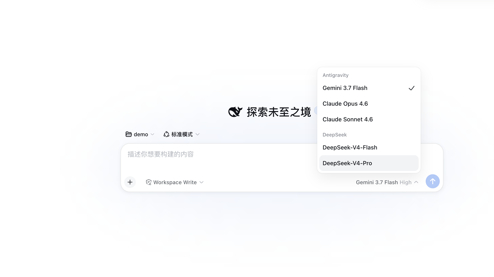
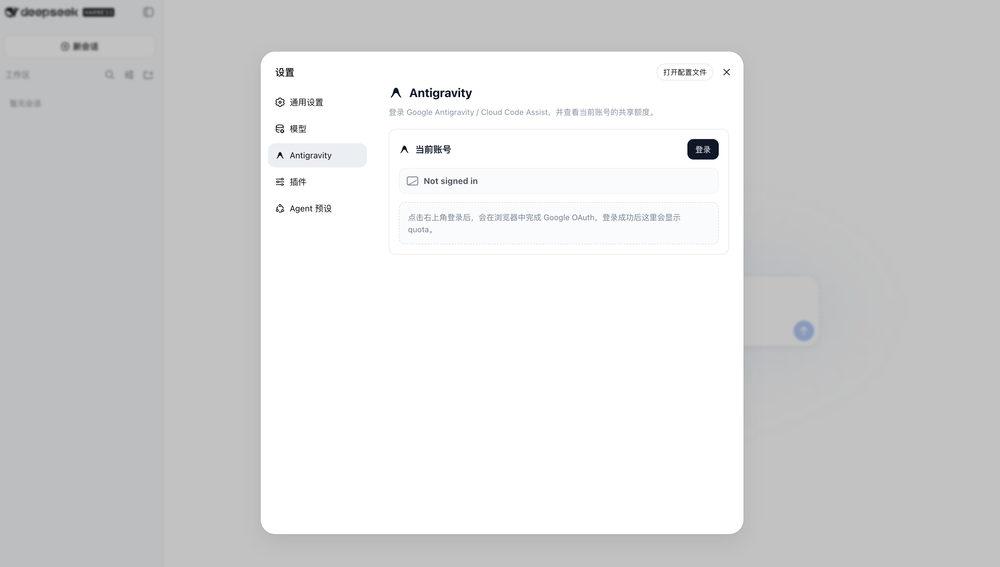
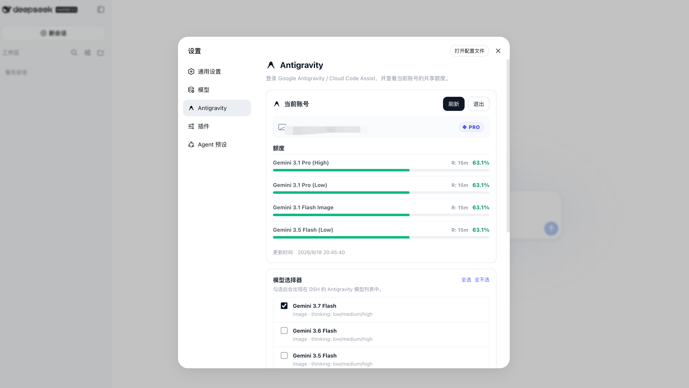

# dsh-antigravity

<p align="center">
  
</p>

Google Antigravity / Cloud Code Assist model provider for
[DeepSeek Harness](https://github.com/deepseek-ai/deepseek-harness).

This is a DSH Web plugin, not a Pi extension. It registers a DSH `LlmAdapter`
under provider route `antigravity`, stores OAuth credentials under DSH home, and
talks to the Cloud Code Assist streaming API directly.

> Unofficial integration. This project is not affiliated with or endorsed by
> Google. Use it only with accounts and services you are authorized to access.

## Install into DSH Web

### Option 1: Direct from GitHub

```sh
dsh plugin --profile web add github:LiZhenNet/dsh-antigravity
```

### Option 2: From Local Release Tarball

```sh
npm run pack:dist
dsh plugin --profile web add ./dist/dsh-antigravity-0.0.1.tgz
```

The package declares a DSH bundle patch, so installation automatically mounts
the host plugin and browser settings page.

If your DSH version does not support `dsh plugin add`, copy the package into
the Web profile manually:

```sh
cp -R dsh-antigravity "$DSH_HOME/profiles/web/node_modules/"
```

Then add the plugin to the profile `cordis.patch.yml`:

```yaml
- insert:
    - id: llm-antigravity
      name: dsh-antigravity
```

Restart DSH:

```sh
dsh web
```

## Login

Open **Settings > Antigravity** and click **Login**. The settings page starts
Google OAuth and refreshes quota after login completes.



After login, the settings page displays account information, live quota bars, reset times, and model selector options:



The plugin starts a loopback OAuth callback server at
`http://localhost:51121/oauth-callback`. If the Web service cannot open a
browser, run the terminal helper on the same machine:

```sh
node "$DSH_HOME/profiles/web/node_modules/dsh-antigravity/bin/antigravity-login.mjs"
```

Credentials are stored at:

```text
$DSH_HOME/storages/antigravity-oauth.json
```

Keep that file private. It contains access and refresh tokens.

## Models

After login, select the **Antigravity** provider in DSH's model picker.

Registered model IDs:

- `gemini-3.7-flash` (Gemini 3.7 Flash)
- `gemini-3.6-flash` (Gemini 3.6 Flash)
- `gemini-3.5-flash` (Gemini 3.5 Flash)
- `gemini-3.1-pro` (Gemini 3.1 Pro)
- `gemini-3.1-flash-image` (Gemini 3.1 Flash Image)
- `gemini-3-flash` (Gemini 3 Flash)
- `gemini-2.5-pro` (Gemini 2.5 Pro)
- `gemini-2.5-flash` (Gemini 2.5 Flash)
- `claude-opus-4-6` (Claude Opus 4.6)
- `claude-sonnet-4-6` (Claude Sonnet 4.6)
- `gpt-oss-120b` (GPT-OSS 120B)

The plugin resolves these public IDs to runtime model IDs using the live
`fetchAvailableModels` catalog when available, with static routing fallbacks.

## License

MIT
